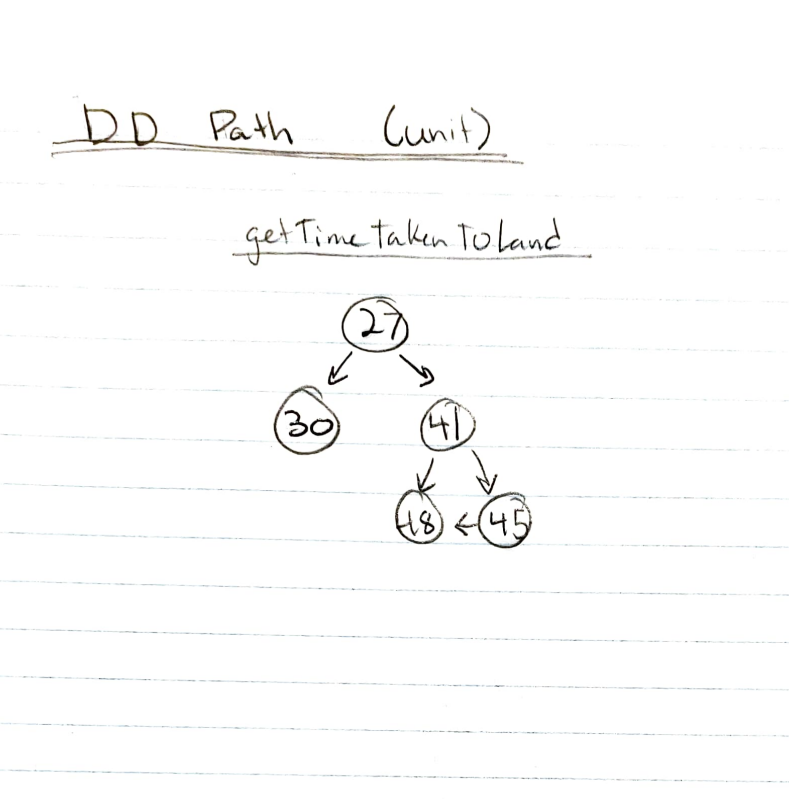
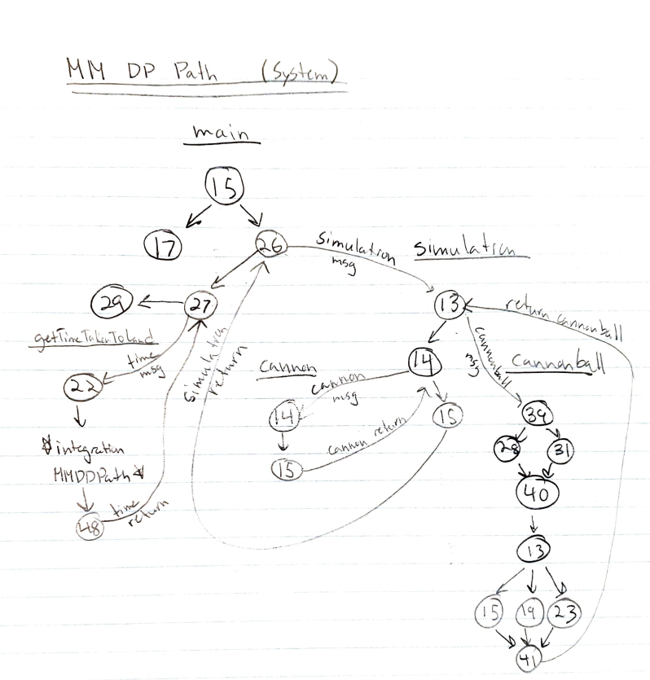
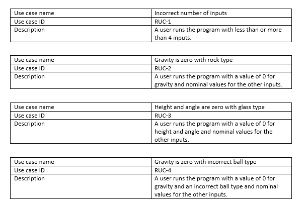
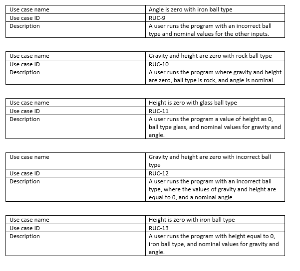

# Testing

##### Project: SENG4110
##### Author: Trevor Drayton

## About 

#### Introduction
The simulation is simple; a Simulation object is created in the main function which receives a value for gravity, height, input, angle, and type. Then, the projectlib::Simulation::getTimeTakenToLand() method is called using the simulation object.

#### Object Oriented Programming
The Simulation object encapsulates and is composed of a Cannon and Cannonball object. The Cannon object is constructed with the height and angle and the cannonball is constructed with the type. Gravity remains as an attribute of the Simulation class.

The Cannonball class inherits the Ball class and polymorphs the projectlib::Ball::setType() and projectlib::Ball::initialVelocity() methods.

#### Testing
The unit and integration tests focus around the projectlib::Simulation::getTimeTakenToLand() method.

In order to differentiate between the unit and integration levels of testing, I created a unit-level and integration-level method of projectlib::Simulation::getTimeTakenToLand() within the testing file (projecttest.cc). Without the abstraction introduced by these methods, I would be limited to perform system testing only.

This program assigns a valid value to any input that is outside the valid ranges.

## Unit Testing
#### Boundary Value
A robust boundary value test was performed because I'm anticipating users to input values outside each input's valid range. Each boundary value is a constant defined in the simulation.h file.
#### Equivalence Class

A normal equivalence class test suite is performed because there is a situation where when angle and height are 0 then we get an output of 0 and a strong boundary value test for values outside valid ranges has already been performed.

Equivalence Classes:
- G1: {gravity: 0 < gravity <= 100.0}
- G2: {gravity: 0}
- A1: {angle: 0 < angle <= 90.0}
- A2: {angle: 0}
- H1: {height: 0 < height <= 100.0}
- H2: {height: < 0}

#### Decision Table
A reduced decision table test was performed first because the limited decision table test cases are identical to the normal equivalence class test cases.

#### Path

#### Dataflow
Does the program satisfy the following criterion?
- All-Defs : YES
- All-Uses : NO
- All-P-Uses/Some C-Uses : NO
- All-C-Uses/Some P-Uses : YES
 

#### Slice
Slice testing was performed on each line of code in projectlib::Simulation::getTimeTakenToLand(). 
## Integration Testing

## System Testing
I used MM Path for System Testing. Each Use Case is one of the system paths.
The following are the paths:
- incorrect number of args -> end
- args correct -> valid type -> rock -> grav is zero || height & angle both are zero -> end
- args correct -> valid type -> glass -> grav is zero || height & angle both are zero -> end
- args correct -> invalid type -> iron -> grav is zero || height & angle both are zero -> end
- args correct -> valid type -> iron -> grav is zero || height & angle both are zero -> end
- args correct -> valid type -> rock -> has height -> end
- args correct -> valid type -> glass -> has height -> end
- args correct -> invalid type -> iron -> has height -> end
- args correct -> valid type -> iron -> has height -> end
- args correct -> valid type -> rock -> has no height -> end
- args correct -> valid type -> glass -> has no height -> end
- args correct -> invalid type -> iron -> has no height -> end
- args correct -> valid type -> iron -> has no height -> end

Test coverage includes Gnode, Gedge, Gchain and Gpath

